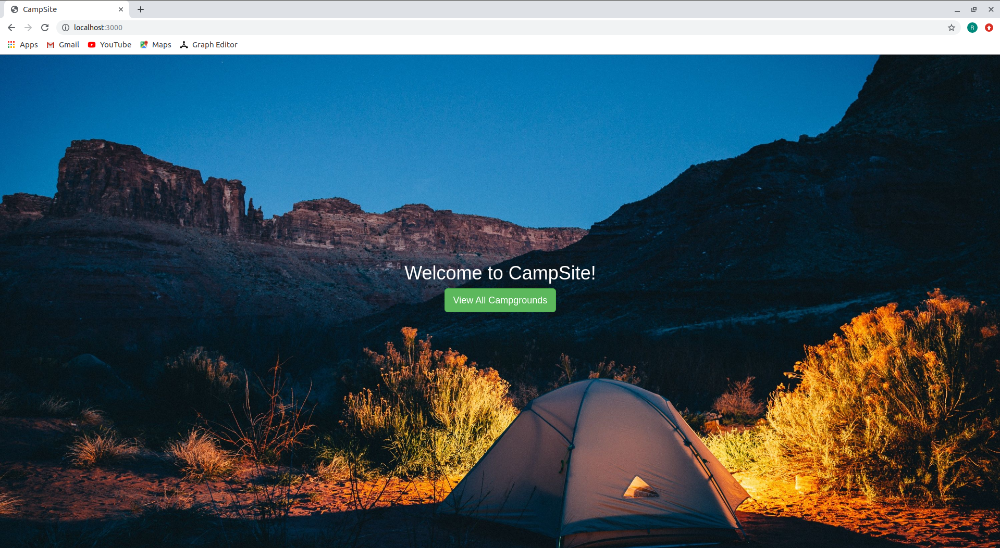

# CampSite

This is a full stack web application in which one make his account, and create and see campgrounds.
The User is authorized to update and delete his own campgrounds. Furthermore, users can write comments on campgrounds. And are allowed only to update or delete their own comments.

### Features :
* Create Read Update Delete Campgrounds.
* Create Read Update Delete Comments.
* SignUp , Login , Logout.
* And various other features.

### Built Using :
* This project is a blend of several technologies. This App is written in NodeJS with MongoDB as the database.
* Some of the packages used to built this app are PassportJS, Mongoose, connect-flash, MomentJS and many more.
* This app has both, Authentication of users as well as Authorization of users.

### Setting Up
* Clone this repo in your system.
* Run the following Commands
```
npm install
node app.js
```
* Open `localhost:3000` in your browser.

## Images



